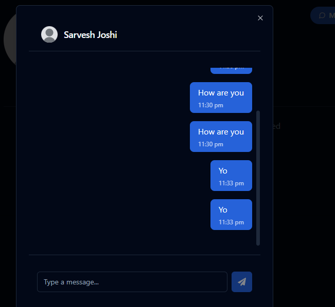

# PICTagram

A blockchain-powered social media platform that reimagines digital interactions through seamless wallet authentication and real-time content sharing, focusing on user engagement and innovative social experiences.

## Features

- User authentication with MetaMask wallet
- Real-time messaging via WebSockets
- Image uploading and post creation
- Social interactions (likes, comments, bookmarks)
- User profiles with editable information
- Category-based content exploration
- Dark/light mode theme support

## Tech Stack

- Frontend: React with TypeScript
- Backend: Node.js with Express
- Database: PostgreSQL with Drizzle ORM
- Authentication: MetaMask wallet integration
- Real-time: WebSocket communication
- Styling: Tailwind CSS with shadcn/ui
- State Management: React Query

## Screenshots

## Development

1. Clone the repository
2. Install dependencies with `npm install`
3. Set up environment variables by copying `.env.example` to `.env` and updating values
4. Start the development server with `npm run dev`
5. The application will be available at `http://localhost:5000`

## Deployment

### Environment Variables

The following environment variables must be configured for deployment:

#### Required
- **Database Configuration**
  - `DATABASE_URL`: PostgreSQL connection string
  - `PGHOST`, `PGPORT`, `PGUSER`, `PGPASSWORD`, `PGDATABASE`: Individual database connection parameters

- **Server Configuration**
  - `PORT`: Server port (defaults to 5000)
  - `NODE_ENV`: Set to 'production' for production deployment

- **File Storage**
  - `UPLOAD_DIR`: Directory for user uploads (profile pictures, post images)

#### Optional
- **WebSocket Configuration**
  - `WS_PATH`: WebSocket endpoint path (defaults to '/ws')
  - `WS_COMPRESSION`: Enable WebSocket compression ('true' or 'false')
  - `WS_MAX_PAYLOAD`: Maximum message size in bytes
  - `WS_SKIP_UTF8_VALIDATION`: Skip UTF8 validation ('true' or 'false')

- **Performance and Security**
  - `CORS_ORIGIN`: Allowed CORS origin
  - `RATE_LIMIT_WINDOW_MS`: Rate limiting window in milliseconds
  - `RATE_LIMIT_MAX_REQUESTS`: Maximum requests per window

### Deployment Steps

1. Install dependencies with `npm install`
2. Set environment variables (see above)
3. Build the application with `npm run build`
4. Start the production server with `npm start`

## License

MIT